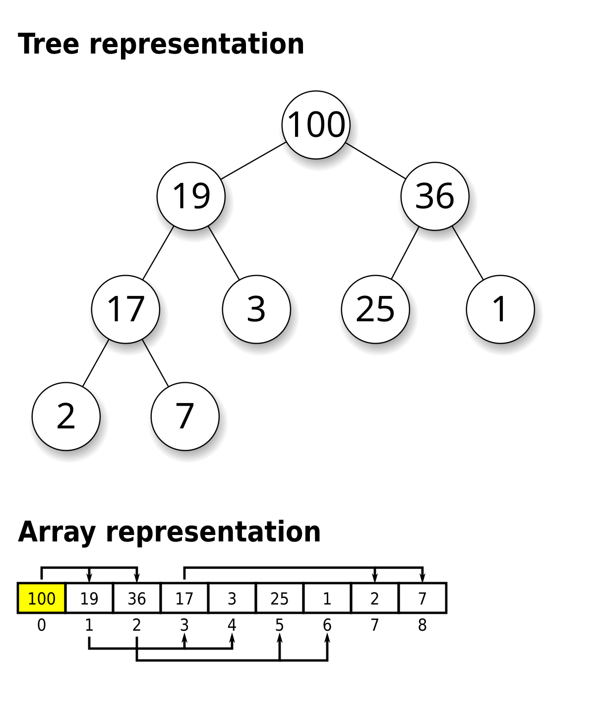

<h1 align=center> Heap Extract </h1>

<div align="center">
  
</div>

## Description

Ce projet implémente une fonction qui extrait la racine (la valeur maximale) d’un **tas binaire maximum** (Max Binary Heap), tout en réorganisant correctement l’arbre pour maintenir les propriétés du tas.

Un Max Binary Heap est une structure d’arbre binaire complet où chaque nœud est supérieur ou égal à ses enfants.  
Lors de l'extraction, la racine est remplacée par le dernier nœud du tas, puis "réajustée" vers le bas afin de restaurer la structure du tas.

---

## Contraintes et détails

- Les programmes sont compilés avec `gcc 4.8.4` et les options : `-Wall -Werror -Wextra -pedantic`
- Le système utilisé est Ubuntu 14.04 LTS
- Le code suit le style **Betty** (`betty-style.pl` et `betty-doc.pl`)
- Aucun usage de variables globales
- Pas plus de **5 fonctions** par fichier
- Tous les fichiers doivent se terminer par une **nouvelle ligne**
- Tous les fichiers d’en-tête doivent être **include guarded**
- Les fichiers de test (`main.c`) ne sont pas requis, ils peuvent être utilisés en local mais ne seront pas pris en compte à l’évaluation
- Toutes les fonctions doivent être déclarées dans le fichier `binary_trees.h`
- Aucune bibliothèque externe n’est utilisée
- Vous êtes autorisé à utiliser la bibliothèque standard C

---

## Installation

Pour cloner et lancer ce projet localement :

```bash
git clone https://github.com/harishammache/holbertonschool-interview.git
cd heap_extract
```
## Tests

Des fichiers de test peuvent être utilisés dans le dossier `./tests` pour valider le comportement de la fonction `heap_extract`.

Exemple :

```bash
gcc -Wall -Werror -Wextra -pedantic -o test_heap main.c heap_extract.c binary_tree_utils.c
./test_heap
```

## Author

Projet réalisé par **Hammache Haris**.


