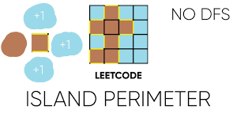

<h1 align="center">Island Perimeter</h1>
<div align="center">
    
</div>

## Description

This project implements a function that calculates the perimeter of an island represented by a 2D grid.

The island is made of land cells (`1`) surrounded by water cells (`0`). Each land cell contributes to the total perimeter depending on how many of its sides are adjacent to water or the edge of the grid.

## Problem Constraints

- `0` represents water
- `1` represents land
- Each cell is square with a side length of 1
- Cells are connected **horizontally** and **vertically**, not diagonally
- The grid is **rectangular**, with width and height not exceeding **100**
- The grid is **entirely surrounded by water**
- There is **only one island** (or none)
- The island does **not contain lakes** (water inside not connected to surrounding water)


## Installation

To get a local copy of this project up and running, follow these steps:

```bash
Clone the repository
git clone https://github.com/harishammache/holbertonschool-interview.git

Navigate into the project directory
cd island_perimeter

```

## Author
Project carried out by Hammache Haris.