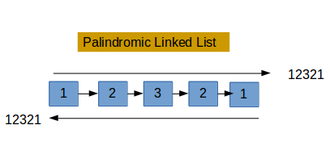

<h1 align="center">Linked list palindrome</h1>
<div align="center">
    
</div>
## Description

This project implements a function in C that checks if a **singly linked list** of integers is a **palindrome**. A palindrome is a sequence that reads the same backward as forward. The function must efficiently determine whether the list satisfies this condition.

## Problem Rules

- You are given a singly linked list.
- You must check whether the list is a palindrome.
- An empty list is considered a palindrome.
- Only standard C is allowed, no external libraries.
- You are not allowed to use global variables.

## Compilation

All files will be compiled on **Ubuntu 14.04 LTS** using **gcc 4.8.4** with the following flags:

```bash
gcc -Wall -Werror -Wextra -pedantic 0-main.c linked_lists.c 0-is_palindrome.c -o palindrome
```

## Coding Standards

- Code must follow the **Betty style guide**
- All files must end with a new line
- Maximum **5 functions per file**
- Function prototypes must be included in a header file named `lists.h`
- All header files must be include guarded
- No global variables

## Main Features

- Implementation of the `is_palindrome(listint_t **head)` function
- Efficient verification of palindrome in singly linked lists
- Memory-safe operations (no leaks)

## Project Files

- **lists.h**: Header file with structure definition and function prototypes
- **linked_lists.c**: Helper functions to manage the linked list (add, print, free)
- **0-is_palindrome.c**: Contains the core palindrome checking logic
- **0-main.c**: Test file (not considered for evaluation)

## Author

Project carried out by **Hammache Haris** as part of learning low-level programming in C with linked lists.