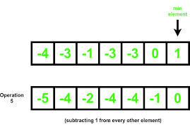

<h1 align="center">Minimum Operations Project</h1>

    

## Description

This project implements an algorithm to calculate the minimum number of operations needed to get exactly `n` characters **H** in a text file. Only two operations are allowed: **Copy All** and **Paste**. The challenge is to determine the most efficient sequence of these operations to reach the target count.

## Problem Rules

- Start with one character **H**.
- Two operations available:
  - **Copy All**: Copies all characters in the file.
  - **Paste**: Pastes the last copied set of characters.
- The objective is to reach exactly `n` characters using the **fewest** operations possible.
- If it is not possible to reach `n`, return `0`.

## Compilation

All files will be interpreted/compiled on **Ubuntu 14.04 LTS** using **Python 3.4.3**, with the following requirements:

## Coding Standards

- All files must begin with: `#!/usr/bin/python3`
- Code is compliant with **PEP 8**
- No more than one function per file unless specified
- Proper documentation is required

## Main Features

- Implementation of the `minOperations(n)` function
- Efficient computation of the fewest steps required
- Handling of impossible cases by returning `0`

## Project Files

- **0-minoperations.py**: Contains the core logic for the minimum operations calculation
- **0-main.py**: Test file (not considered for evaluation)

## Usage

To test the program, make sure your test file is executable and run:

## Author

Project carried out by Hammache Haris as part of learning Python programming.
