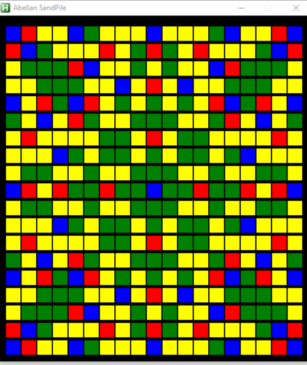

<h1 align="center">Sandpiles Project</h1>
<div align="center">
    
</div>

## Description

This project implements stable sandpiles on a 3x3 grid following stabilization rules. An unstable pile is a cell containing more than 3 grains of sand, which causes a redistribution of these grains to adjacent cells.

## Stabilization Rules

- A cell is considered unstable if it contains more than 3 grains.
- When a cell becomes unstable, it distributes 4 grains to the adjacent cells (top, bottom, left, right).
- This redistribution can make other cells unstable, leading to a cascading stabilization process.
- The process continues until all cells contain 3 grains or fewer.

## Compilation

All files will be compiled on Ubuntu 14.04 LTS with gcc 4.8.4, using the following options:

```
-Wall -Werror -Wextra -pedantic
```

## Coding Standards

- Code follows the Betty Style (checked with betty-style.pl and betty-doc.pl).
- No global variables.
- No more than 5 functions per file.
- All files must end with a new line.

## Main Features

- Implementation of sandpile addition
- Stabilization of a sandpile by applying the problem's rules
- Verification of a sandpile's stable state

## Project Files

-**sandpiles.h**: Contains function prototypes and necessary definitions
-**0-sandpiles.c**: Implements the stabilization of sandpiles
-**main.c**: Test file (not considered for evaluation)

## Usage

To test the program, compile and run a main.c file:

```
xgcc -Wall -Werror -Wextra -pedantic 0-sandpiles.c main.c -o sandpiles ./sandpiles
```


## Author
Project carried out by Hammache Haris as part of learning C programming.