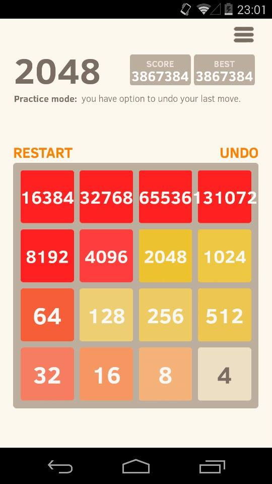

<h1 align="center">2048 (Single Line)</h1>
<div align="center">
    
</div>

---

## 📚 Description

This project aims to recreate the core mechanics of the popular 2048 game — but on a **single horizontal line**.  
You’ll implement sliding and merging of numbers to the left or right, respecting 2048's logic: adjacent identical numbers (even separated by zeros) merge into one.

---

## 🎯 Learning Objectives

- Deepen understanding of **array manipulation**
- Implement a **sliding and merging algorithm**
- Learn how to handle **edge cases** without dynamic memory allocation
- Respect **project constraints and clean coding standards (Betty style)**

---

## 🛠️ Function Prototype

```c
int slide_line(int *line, size_t size, int direction);
