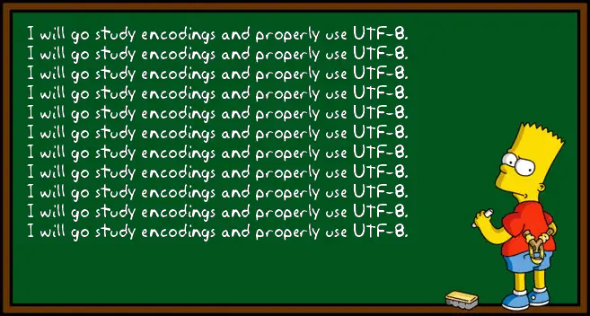

<h1 align="center">UTF-8 Validation</h1>

    

---

## 📜 Description

Ce projet implémente une fonction Python qui vérifie si une séquence d’octets est une **représentation UTF-8 valide**.

UTF-8 est un format d'encodage de caractères utilisé partout dans le monde. Il permet de représenter tous les caractères Unicode à l’aide d’un à quatre octets. Cette validation est cruciale lorsqu’on traite des fichiers texte, des API ou des flux de données multilingues.

---

## 🚧 Contraintes

- Chaque caractère UTF-8 peut avoir de 1 à 4 octets.
- Les entiers de la liste représentent chacun un octet (8 bits).
- L’entrée est une **liste d’entiers**.
- Il faut vérifier si la séquence représente correctement une ou plusieurs lettres UTF-8, selon les règles de codage Unicode.

---

## Author
Projet réalisé par Hammache Haris.